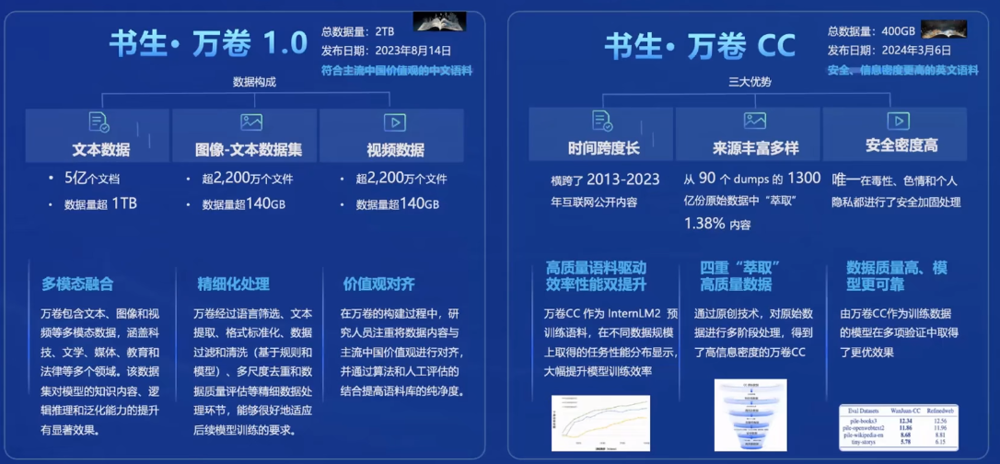

[toc]
# 大模型全链路开源体系

### 背景

- 通用大模型

- 专用模型

### 书生·浦语大模型开源历程

##### 书生·浦语2.0(lnternLM2)

> 每个规格包含三个模型版本
>
> - InternLM2-Base
> - InternLM2
> - InternLM2-Chat

- 回归语言建模的本质

  

- 亮点

  

- 应用

  - 贴心的AI助手
  - 人文关怀的对话
  - 富有想象力的创作

- 模型到应用典型流程

  

### 书生·浦语大模型开源开放体系

##### 开放高质量语料数据

> 获取方式：[OpenDataLab](https://opendatalab.org.cn/)

##### 预训练

##### 微调

- 增量续训
  - 使用场景：让基座模型学习到一些新知识，如某个垂类领域知识
  - 训练数据：文章、书籍、代码等
- 有监督微调
  - 使用场景：让模型学会理解各种指令进行对话，或者注入少量领域知识
  - 训练数据：高质量的对话、问答数据

##### 部署

##### 评测

> CompassHub:高质量评测基准社区开源开放，共建共享的大模型评测基准社区

**OpenCompass2.0司南大模型评测体系正式发布**

- 整体能力仍有较大提升空间

  > 采用了更加准确的**循环评测策略**，我们实现了对模型真实能力分析。在百分制的客观评测基准中，GPT-4-Turbo也仅仅达到了61.8分的及格水平。

- 复杂推理仍是短板

  >  国内多个模型综合能力和GPT-4-Turbo在接近，但在复杂推理上仍然存在较大差距，并且和模型尺寸存在较强相关性。

- “理科”能力和模型尺寸关联性高

  > 在语言和知识这类“文科”维度，中轻量级模型和重量级/闭源商业模型差距较小，但数学、推理、代码等维度上，性能和尺寸呈现较强相关性

- 模型主客观性能需综合参考

  > 大量开源模型和API模型的客观性能和主观性能存在较大的偏差，社区不仅仅需要夯实客观能力基础，更需要在偏好对齐和对话体验上下功夫。

  

##### 部署

##### 应用

- 轻量级智能体框架Lagent

  

- AgentLego工具箱

  

