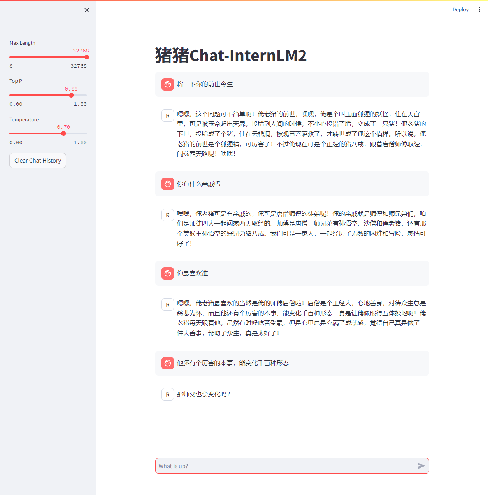
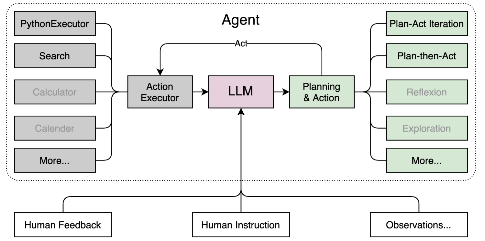
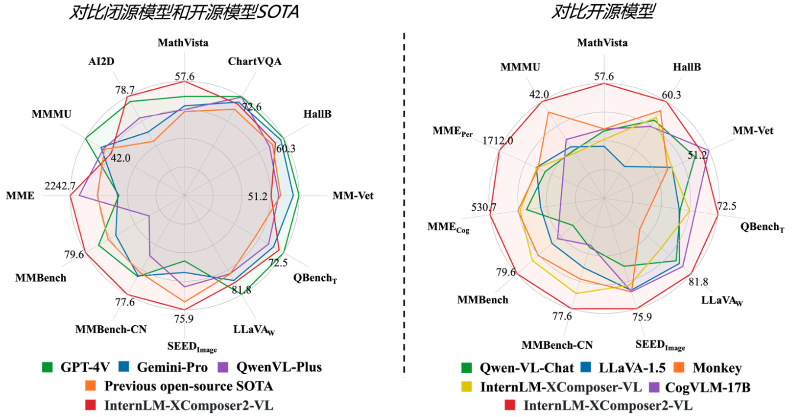

[toc]

# 角色扮演SIG

- 综合角度
  - 角色代入
  - 角色微调
  - 角色评测

- 优秀作品
  - Chatty-Horo
  - Roleplay-with-XiYou
  - Chat-嬛嬛

# 部署InternLM2-Chat-1.8B

### 流程

1. 创建开发机
   - 创建环境
   - 创建必要的文件
     - download文件：用于下载模型
     - client文件：用于启动模型
2. 部署本地Demo

# 部署八戒-Chat-1.8B

### 部署自定义模型

# 运行Lagent智能体Demo

> 关机，进行资源的升级30%A100

### Lagent智能体

> Lagent 是一个轻量级、开源的基于大语言模型的智能体（agent）框架，支持用户快速地将一个大语言模型转变为多种类型的智能体，并提供了一些典型工具为大语言模型赋能。

# 灵笔InternLM-XComposer2

> 关机，进行资源的升级50%A100

- 图文写作

- 图像理解

